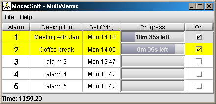

# Multi-Alarms

Multi Alarms is a Java GUI (using Swing) to show a series of alarms (one per row)
that can be set to run simultaneously.

Each alarm counts down and plays a configured sound to alert the user.



## Background
I wrote MultiAlarms in 2003 for a cinema projectionist
who needed to run multiple alarms (up to 5) at a time in order to keep track of
which cinemas needed to have reels attended to.

I then found it generally useful but it lay forgotten in the source code cupboard of my machine
as I moved on to other things.
So I've created this GitHub repository for it, for posterity.

### Build & Run

Requires a JDK on `PATH` (Java 8 or later — tested with OpenJDK 11).
No external build tool needed; the `Makefile` drives plain `javac` and `jar`.

```sh
make            # compile and build dist/MultiAlarms.jar
make run        # build and launch the GUI
make clean      # remove build output
```

The resulting `dist/MultiAlarms.jar` is a self-contained runnable jar
(the `kunststoff` look-and-feel library is bundled in), so it can also be
launched directly with `java -jar dist/MultiAlarms.jar` or by double-clicking.

