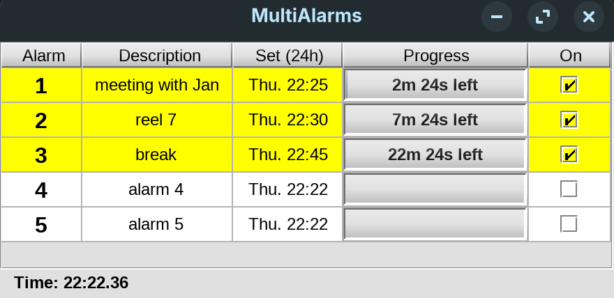

# Multi-Alarms

Multi Alarms is a Java app that shows multiple alarms that can be set to run simultaneously.

Each alarm counts down and plays a sound to alert the user.




## Background
I wrote MultiAlarms in 2003 for a cinema projectionist who needed to run multiple alarms in order to keep track of cinemas needing to have reels attended to.

I then found it generally useful, but it lay forgotten in the source-code cupboard of my machine - as I moved on to other things.
So I've created this repository for posterity.

### Build & Run

Requires a JDK on `PATH` (Java 11 or later). 
The `Makefile` drives plain `javac` and `jar`.

```sh
make            # compile and build dist/MultiAlarms.jar
make run        # build and launch the GUI
make clean      # remove build output
```

The resulting `dist/MultiAlarms.jar` is a self-contained runnable jar
(the `kunststoff` look-and-feel library is bundled in), so it can also be
launched directly with `java -jar dist/MultiAlarms.jar` or by double-click.
