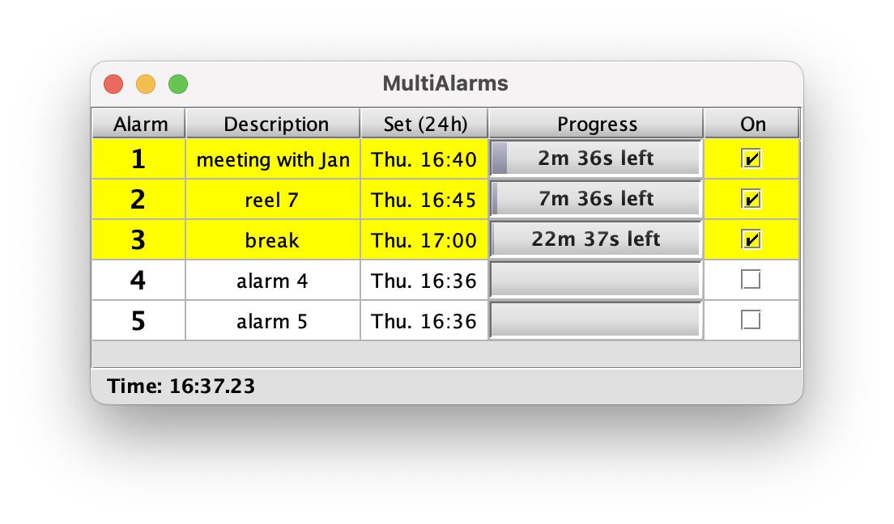

# Multi-Alarms

Multi Alarms is a Java app (using Swing) to show multiple alarms that can be set to run simultaneously.

Each alarm counts down and plays a sound to alert the user.



## Background
I wrote MultiAlarms in 2002 for a cinema projectionist who needed multiple alarms in order to keep 
track of multiple cinema movies stopping and starting - since his job was dealing with film reels in a theatre with 5 screens.

I then found the software generally useful but it lay forgotten in the code-cupboard of my machine as I moved on to other things.
So I've created this repository for posterity.

The original code from 2002 is in the git history. But I later made some changes for modern machine support and to fix deprecated code. And later again, to incorporate Java 17 language features and improvements. It was a great way to get back up to speed with Java > 2, by starting with an old project like this.

### Build & Run

Requires a JDK on `PATH` (Java 17 or later). 
The `Makefile` drives plain `javac` and `jar`, so it works on any OS with `make`.

```sh
make            # compile and build dist/MultiAlarms.jar
make run        # build and launch the GUI
make clean      # remove build output
```

To build against a specific JDK rather than the one on `PATH`:

```sh
make JAVA_HOME=/path/to/jdk
```

<details>
<summary>macOS: if <code>javac</code> is an old version</summary>

Homebrew's `openjdk` is keg-only, so it is not on `PATH` and the system Java
wrappers can't see it. Register it once and `javac` picks it up:

```sh
sudo ln -sfn $(brew --prefix openjdk)/libexec/openjdk.jdk \
             /Library/Java/JavaVirtualMachines/openjdk.jdk
```
</details>

The resulting `dist/MultiAlarms.jar` is a self-contained runnable jar
(the `kunststoff` look-and-feel library is bundled in), so it can also be
launched directly with `java -jar dist/MultiAlarms.jar` or by double-click.
